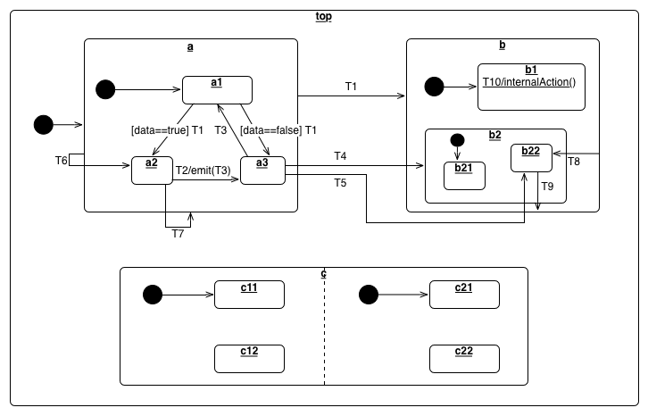

# Hierarchial State Machine for Javascript

[![Build Status][BS img]][Build Status] [API docs](http://mask.github.io/hsm-js/HSM.html)

## Description

Simple, yet powerful hierarchial state machine framework. Supports Sub-Statemachines (nested states) and Parallel-Statemachines (orthogonal regions) and entry and exit handlers.  

The following state machine is used [in the tests](test/testAdvanced.js) and this documentation to illustrate the features.

## States and State Machines

States are specified by creating HSM.State instances. They are then composed to a state machine by passing them to the HSM.StateMachine constructor.

        var a1 = new HSM.State("a1");
        var a2 = new HSM.State("a2");
        var a3 = new HSM.State("a3");
        var a = new HSM.StateMachine([a1,a2,a3]);

By convention, the first state passed is the initial state. The state machine is then initialized by HSM.StateMachine.init():

        a.init();

This starts the state machine and activates the initial state, calling its entry handler (see below). The state machine is now ready to 
handle events.

## Actions and State Transitions

Each state has a map of event handlers. These handlers will be called when the state receives the respective event.
Event handlers are added to the handler[] array of each state:

    a3.handler['T3'] = { next: a1 };

This specifies a transition from State to newState for event. Additionally, an action can be added to the transition:

    a2.handler['T2'] = { next: a3, action: function() { this.emit('T3') };

Events are triggered by calling the StateMachine.handleEvent() method. This can even be done inside an event handler's actionFunc.  If an event is 
triggered while an event is being handled it will be queued until the current event completes. This is known as the run-to-completion (RTC) execution model.  

## Guards 

Guards (or guard conditions) affect the behaviour of a state machine by enabling actions or transitions only when they evaluate to TRUE and disabling them when they evaluate to FALSE. 
When using guards, multiple event handlers can be bound to a single trigger with a guard. Each guard is evaluated until one returns true. The respective handler is then invoked (after calling
the usual exit handler).

        a1.handler.T1 = [
            { next: a2, guard: function (_,_,data) { return data==true; } },
            { next: a3, guard: function (_,_,data) { return data==false; } }
        ];

## Sub-StateMachines (nested)

State Machines can be nested in other state machines my using the HSM.Sub adapter class. All events are propgated into the sub-state machines, and the sub state 
machine is initialized and torn down on entry/exit of its containing state.

        var a1 = new HSM.State("a1");
        var a2 = new HSM.State("a2");
        var a3 = new HSM.State("a3");

        var a = new HSM.Sub("a", new HSM.StateMachine([a1, a2, a3]));

_a_ is a State which can be used to construct the _top_ state machine.

## Parallel State-Machines (orthogonal regions)

Parallel state machines are constructed with the HSM.Parallel adapter class.

        var c11 = new HSM.State("c11");
        var c12 = new HSM.State("c12");
    
        var c21 = new HSM.State("c21");
        var c22 = new HSM.State("c22");
        
        var c = new HSM.Parallel("c", new HSM.StateMachine([c11, c12]), 
                                      new HSM.StateMachine([c21, c22]));

again, _c_ is a State which can be used in the constructor of the _top_ state machine.

## Entry and Exit Actions

Each state can have a on\_entry and/or on\_exit function. They will be invoked when the state is entered or exited. 

## Internal, External and Local Transitions (TODO)

[Build Status]: https://travis-ci.org/Mask/hsm-js
[BS img]: https://travis-ci.org/Mask/hsm-js.png

